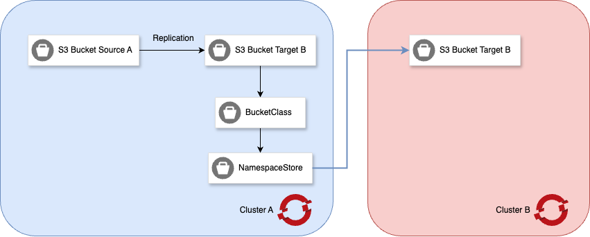

# Bucket data replication

NooBaa supports data replication policies to asynchronize data across multiple buckets. This is essential for disaster recovery and high availability, ensuring your data is replicated across multiple locations.



In this setup, Bucket A (shown as Bucket Source A in the diagram) supports both read and write operations.
Any data written to Bucket A—using the BucketClass and NamespaceStore objects—is automatically replicated to two Bucket B instances, located on Cluster A and Cluster B.

All buckets, along with their replicated data, remain fully accessible from both clusters.

Notes:
- Replication is unidirectional: Data written to Bucket Source A is replicated to Bucket Target B, but not vice versa.
- Replication is asynchronous: Data replication from Bucket Source A to Bucket Target B is not synchronous.


### Prerequisites
Follow the steps in the `installation.md` file to install the NooBaa CRDs and Operator.

### Bucket Class Replication

Bucket replication policies can be applied to a BucketClass. In those cases, the policy will automatically be 'inherited' by all bucket claims that utilize the bucketclass.

**Replication Policy**

We can set replication policy under the `spec.placementPolicy.` field of the BucketClass.

PlacementPolicy is an array of rules:

- `rule_id` defines the unique identifier of the rule.
- `destination_bucket` definers the replication target bucket.
- `filter` field defines the filter to apply to the source bucket during replication.

## High-Level Steps of this Guide:

1) Create a separate backing store for replication.
2) Create a simple bucket class by refering this backing store.
3) Create a NameSpaceStore refering to the aws S3. 
4) Create a BucketClass with replication policy.
5) Create an ObjectBucketClaim with refering the replication bucket class.


**Create a BackingStore**

Let's create a separate local pv pool backing store for replication.

```bash
apiVersion: noobaa.io/v1alpha1
kind: BackingStore
metadata:
  name: pv-pool-backing-store
  namespace: noobaa
spec:
  pvPool:
    numVolumes: 1
    resources:
      requests:
        storage: 16Gi
        memory: 4Gi
        cpu: 2000m
      limits:
        memory: 4Gi
        cpu: 2000m
  type: pv-pool
```

**Create Bucket Class**

Let's create a simple bucket class by refering this backing store.

```yaml
apiVersion: noobaa.io/v1alpha1
kind: BucketClass
metadata:
  name: pv-pool-bucket-class
spec:
  placementPolicy:
    tiers:
      - backingStores:
          - pv-pool-backing-store
```

here,
- `tiers` is the placement policy.`
- `pv-pool-backing-store` is the backing store we created above.


**Create `S3` Backing Store**

For AWS S3 Create a secret with your AWS credentials:
```bash
kubectl create secret generic aws-s3-creds \
  --from-literal=AWS_ACCESS_KEY_ID=<YOUR_AWS_ACCESS_KEY_ID> \
  --from-literal=AWS_SECRET_ACCESS_KEY=<YOUR_AWS_SECRET_ACCESS_KEY>
```

Then, create the BackingStore manifest:
```yaml
apiVersion: noobaa.io/v1alpha1
kind: NamespaceStore
metadata:
  name: azure-namespacestore
  namespace: noobaa
spec:
  type: azure-blob
  azureBlob:
    targetBlobContainer: noobaa
    secret:
      name: azure-secret
      namespace: noobaa
```
Here,
- `targetBucket` is the name of the bucket that will be created in the cloud provider.
- `secret` is the name of the secret that contains the AWS credentials.


**Create a BucketClass with Replication Policy**

Now, let's create a BucketClass with replication policy, which is inherited by all bucket claims that utilize the bucketclass.

```yaml
apiVersion: noobaa.io/v1alpha1
kind: BucketClass
metadata:
  name: bs-replication
  namespace: noobaa
spec:
  placementPolicy:
    tiers:
      - backingStores:
          - local-pv-pool-dc1
  replicationPolicy: |
    {
      "rules": [
        {
          "rule_id": "rule-1",
          "destination_bucket": "anisur-6843096f-2ed8-4eb5-8d1e-ad15dd8df9c2"
        }
      ]
    }
```

### ObjectBucketClaim Replication


